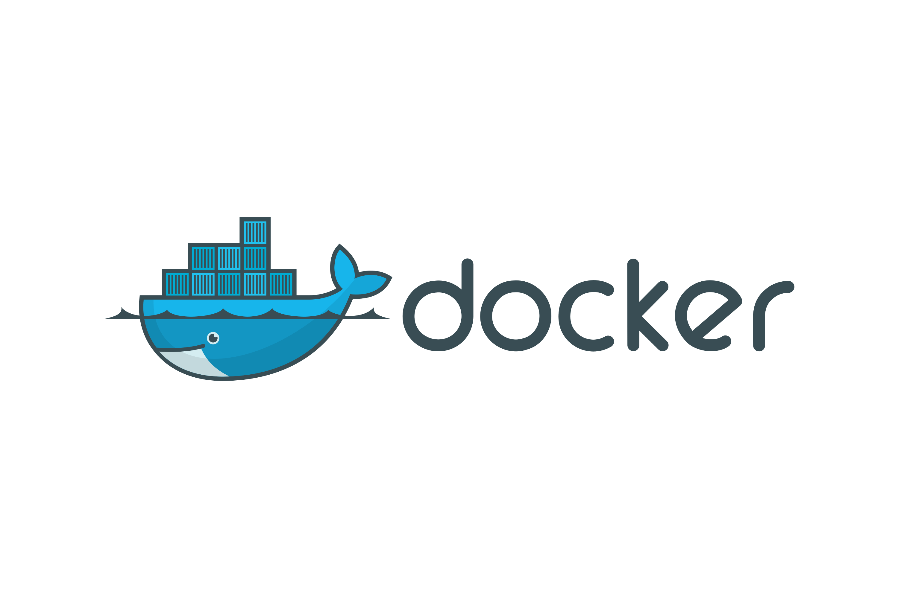

 

I'm a self-taught passionate Full-Stack Blockchain Developer from India 🇮🇳

**About me**

- 💼 Blockchain Engineer at [Solulab](https://www.solulab.com/)

- ❤️ I love writing code, and building fun experiments

- 💬 Ask me about anything [here](https://github.com/DEREK-DEV-AFK/DEREK-DEV-AFK/issues)

<code></code>
<code></code>
<code></code>
<code></code>
<code></code>    
<code></code>    
<code></code>    
<code></code>    

|  |  |
| ------------- | ------------- |

 
 

